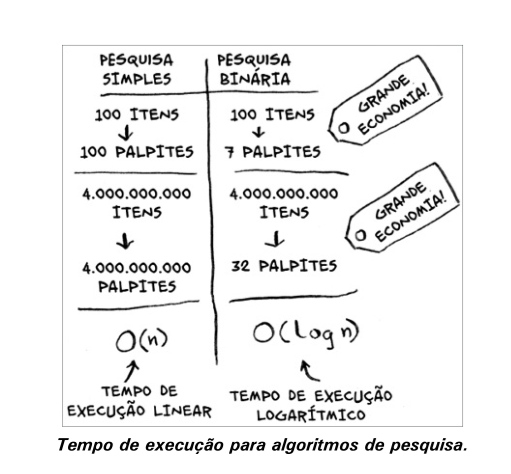

# Capítulo 1 - Introdução a algoritmos

Um algoritmo é um conjunto de instruções que realizam uma tarefa. Cada trecho de código poderia ser chamado de um algoritmo, mas o livro Entendendo Algoritmos trata dos trechos mais interessantes. Os algoritmos apresentados nesse livro foram escolhidos porque eles são rápidos ou porque resolvem problemas interessantes, ou por ambos os motivos. 

## Pesquisa Binária
A pesquisa binária é um algoritmo. Sua entrada é uma lista ordenada de elementos. Se o elemento que você está buscando está na lista, a pesquisa binária retorna a sua localização. Caso contrário, a pesquisa binária retorna None.
Vamos ver um exemplo:
Estou pensando em um número entre 1 e 100. Você deve procurar adivinhar o meu número com o menor número de tentativas possível. A cada tentativa, digo se você chutou muito para cima, muito para baixo ou corretamente. Porém, você começou assim: 1, 2, 3... Demoraria até você acertar o número caso ele fosse o 99. Este tipo de pesquisa se chama **pesquisa simples (ou estúpida)**. Pois a cada tentativa você está eliminado apenas um número e isso poderia demorar uma eternidade se a lista fosse bem maior e o sorteado fosse o último.

### Uma maneira melhor de pesquisar
Aqui está uma técnica melhor. Comece com 50. Ainda pode ser um pouco baixo mas você eliminou metade dos números! Agora, você sabe que os números de 1 a 50 são muito baixos. Próximo chute: 75, muito alto, próximo chute: 63, está entre 50 e 63, próximo chute: 57, acertou!
Esse tipo de pesquisa se chama **pesquisa binária**. Aqui está a quantidade de números que podemos eliminar a cada tentativa.
- 100 itens -> 50 -> 25 -> 13 -> 7 -> 4 -> 2 -> 1, ou seja, 7 etapas.

*Elimine metade dos números a cada tentativa com a pesquisa binária.*

Seja qual for o número que eu estiver pensando, você pode adivinhá-lo em um máximo de sete tentativas – porque a pesquisa binária elimina muitas possibilidades.

Suponha que você esteja procurando uma palavra em um dicionário. O dicionário tem 240.000 palavras. Na pior das hipóteses, de quantas etapas você acha que a pesquisa precisaria?
A pesquisa simples poderia levar 240.000 etapas se a palavra que você estivesse procurando fosse a última do dicionário. A cada etapa da pesquisa binária, você elimina o número de palavras pela metade até que só reste uma palavra.
Logo, a pesquisa binária levaria apenas 18 etapas – uma grande diferença!
De maneira geral, para uma lista de n números, a pesquisa binária precisa de log2n para retornar o valor correto, enquanto a pesquisa simples precisa de n etapas.

> *Pesquisa binária só funciona quando a sua lista está ordenada. Por exemplo, os nomes em uma agenda telefônica estão em ordem alfabética, então você pode utilizar a pesquisa binária para procurar um nome. O que aconteceria se a lista não estivesse ordenada?
Se a lista não estivesse ordenada, a pesquisa binária não seria eficaz, pois depende da ordenação para funcionar corretamente aí seria necessário usar uma pesquisa sequencial.*

### Tempo de execução
Voltando à pesquisa simples, quanto tempo se otimiza utilizando ela? A primeira abordagem seria verificar número por número. Se fosse uma lista de 100 números, seria necessário de 100 tentativas. Se fosse uma lista de 4 bilhões de números, precisaríamos de 4 bilhões de tentativas. Logo, o número máximo de tentativas é igual ao tamanho da lista. Isso é chamado de *tempo linear*.

A pesquisa binária é diferente. Se a lista tem 100 itens, precisa-se de, sete tentativas no máximo. Se tem 4 bilhões, precisa-se de, 32 tentativas. A pesquisa binária é executada com *tempo logarítmico*. Veja a tabela a seguir:

## Notação Big O
A notação *Big O* serve para dizer quão rápido é um algoritmo. Mas pra quê isso? Ora, saber a eficiência de um algoritmo é importante para escolhermos o melhor algoritmo para um determinado problema. E isso economiza tempo, memória e outros recursos.

Como foi dito, a notação Big O informa o quão rápido é um algoritmo. Por exemplo, imagine que você tem uma lista de tamanho n. O tempo de execução na notação Big O é O(n). Onde estão os segundos? Eles não existem – a notação Big O não fornece o tempo em segundos. A notação Big O permite que você compare o número de operações. Ela informa o quão rapidamente um algoritmo cresce.

A pesquisa binária precisa de log *n* operações para verificar uma lista de tamanho n. Qual é o tempo de execução na notação Big O? É O(log n). Com o tempo de execução O(log n), por exemplo, você levará quatro operações para desenhar uma grade com 16 divisões (log 16 é 4). Logo, levará 0,4 segundos para desenhar a grade.

### Alguns exemplos comuns de tempo de execução Big O

- O(log n), também conhecido como tempo logarítmico. Exemplo: pesquisa binária.
- O(n), conhecido como tempo linear. Exemplo: pesquisa simples.
- O(n * log n). Exemplo: um algoritmo rápido de ordenação, como a ordenação quicksort.
- O(n2). Exemplo: um algoritmo lento de ordenação, como a ordenação por seleção.
- O(n!). Exemplo: um algoritmo bastante lento, como o do caixeiro-viajante.

## Recapitulando
- A pesquisa binária é muito mais rápida do que a pesquisa simples.
- O(log n) é mais rápido do que O(n), e O(log n) fica ainda mais rápido conforme os elementos da lista aumentam.
- A rapidez de um algoritmo não é medida em segundos.
- O tempo de execução de um algoritmo é medido por meio de seu crescimento.
- O tempo de execução dos algoritmos é expresso na notação Big O.

---
## ***Anotações do capítulo 1 do livro Entendendo Algoritmos Um Guia Ilustrativo Para Programadores e Outros Curiosos***